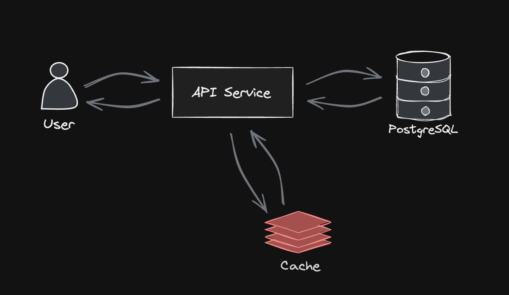
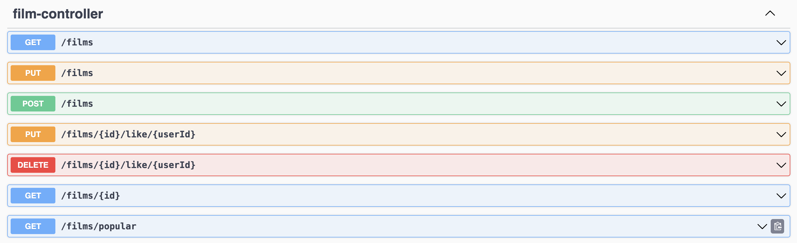
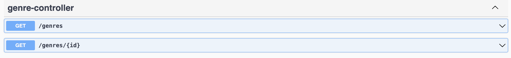
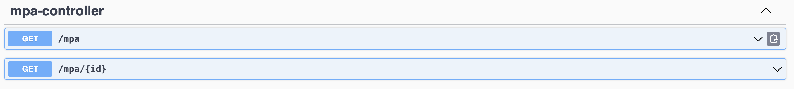

# Filmorate
> Это проект, который позволяет хранить данные о фильмах и пользователях, а также выполнять базовые функции, такие как добавление, обновление и удаление фильмов/пользователей. Кроме того, Filmorate предоставляет информацию о самых популярных фильмах и списке друзей пользователей.

## Функциональные требования:
- **Добавление фильма:** 
    -  Пользователь может добавить новый фильм в базу данных.
    -  Обязательные поля: название фильма, описание, продолжительность, рейтинг MPA.
    -  Валидация даты релиза с помощью аннотации @ReleaseDate.
- **Обновление фильма:**
    - Пользователь может обновить информацию о существующем фильме.
    - Поля для обновления: описание, продолжительность, рейтинг MPA.
- **Поиск фильмов:**
    - Пользователь может получить список всех фильмов.
    - Поиск фильма по его уникальному идентификатору.
- **Лайки и друзья:**
  - Пользователь может ставить лайки фильмам и убирать их.
  - Методы для управления списком друзей пользователя.
- **Жанры фильмов:**
  - Сервис должен поддерживать жанры фильмов.
- **Кеширование:**
  - Сервис должен кешировать все популярные запросы.
 
## Архитектурная диаграмма


## Endpoints documentation





### Films

Get All Films:  
```sql 
SELECT * FROM film;
```
Get Top Films:  
```sql
SELECT film_id FROM film_likes  
GROUP BY film_id  
ORDER BY COUNT(user_id);
```

Get Film By Id:  
```sql
SELECT * FROM film  
WHERE film_id={id};
```

### Users

Get All Users:
```sql
SELECT * FROM user;
```

Get Friends List For User:  
```sql
SELECT friend_id FROM user_friends  
WHERE user_id={id};
```

Get Common Friends List:
```sql
SELECT friend_id FROM user_friends  
WHERE user_id={id1}  
AND friend_id IN (SELECT friend_id FROM user_friends
                    WHERE user_id={id2});
```

Get User By Id
```sql
SELECT * FROM user  
WHERE user_id={id};
```
